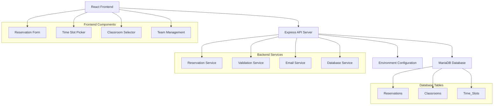
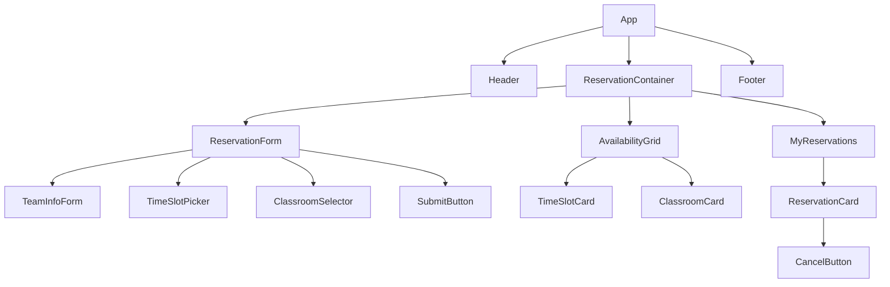
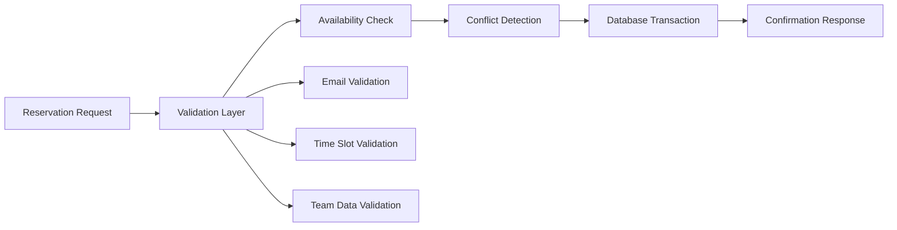
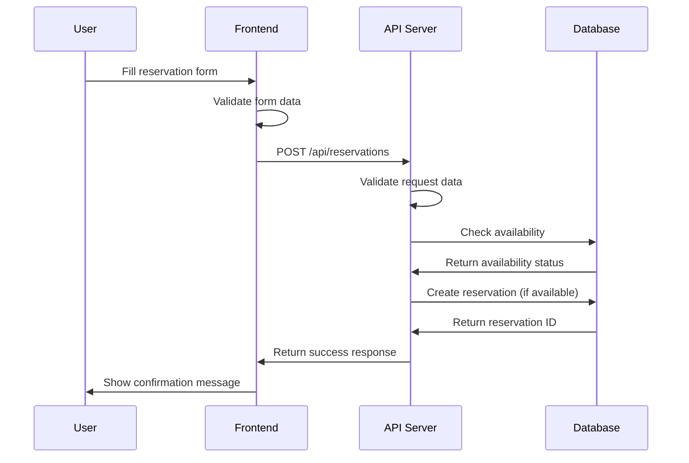
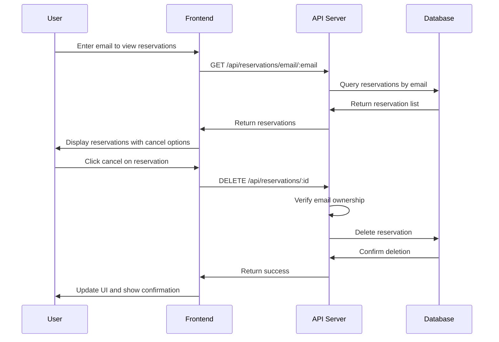

# Classroom Reservation System Design

## Overview

The Classroom Reservation System is a full-stack web application that enables teams to reserve classrooms for specific time slots. The system provides a user-friendly interface for booking 30-minute time slots across 5 available classrooms, with team management capabilities and email-based reservation management.

### Key Features
- Classroom reservation with time slot selection
- Team-based booking system
- Email-based reservation management
- Real-time availability checking
- Reservation cancellation functionality

### Technology Stack
- **Frontend**: React.js
- **Backend**: Node.js with Express
- **Database**: MariaDB
- **Configuration**: Environment variables (.env)

## Architecture

### System Architecture Overview



## Frontend Architecture

### Component Hierarchy



### Component Specifications

#### ReservationForm Component
- **Props**: `onSubmit`, `availableSlots`
- **State**: `teamData`, `selectedTime`, `selectedClassroom`
- **Functionality**: 
  - Collects team information (team name, teammates, contact email)
  - Validates form data
  - Submits reservation request

#### TimeSlotPicker Component
- **Props**: `availableSlots`, `onTimeSelect`, `selectedDate`
- **State**: `selectedSlot`
- **Functionality**:
  - Displays 30-minute time slots
  - Shows availability status
  - Handles time selection

#### ClassroomSelector Component
- **Props**: `classrooms`, `onClassroomSelect`, `selectedTime`
- **State**: `selectedClassroom`
- **Functionality**:
  - Lists 5 available classrooms
  - Shows real-time availability
  - Handles classroom selection

### State Management

#### Application State Structure
```javascript
{
  reservations: {
    current: [],
    loading: false,
    error: null
  },
  availability: {
    timeSlots: [],
    classrooms: [],
    matrix: {}
  },
  user: {
    email: '',
    currentReservations: []
  }
}
```

### API Integration Layer

#### API Service Structure
```javascript
// reservationService.js
const API_BASE = process.env.REACT_APP_API_URL;

export const reservationAPI = {
  getAvailability: (date) => GET(`${API_BASE}/availability/${date}`),
  createReservation: (data) => POST(`${API_BASE}/reservations`, data),
  getReservationByEmail: (email) => GET(`${API_BASE}/reservations/email/${email}`),
  cancelReservation: (id, email) => DELETE(`${API_BASE}/reservations/${id}`, { email })
};
```

## Backend Architecture

### API Endpoints Reference

#### Reservation Endpoints

| Method | Endpoint | Description | Authentication |
|--------|----------|-------------|----------------|
| GET | `/api/availability/:date` | Get available time slots for date | None |
| POST | `/api/reservations` | Create new reservation | Email validation |
| GET | `/api/reservations/email/:email` | Get reservations by email | Email validation |
| DELETE | `/api/reservations/:id` | Cancel reservation | Email validation |
| GET | `/api/classrooms` | Get all classrooms | None |

#### Request/Response Schemas

**POST /api/reservations**
```json
{
  "teamName": "string",
  "teammates": ["string"],
  "contactEmail": "string",
  "classroomId": "number",
  "timeSlot": "ISO8601 datetime",
  "duration": 30
}
```

**Response**
```json
{
  "success": true,
  "reservation": {
    "id": "number",
    "teamName": "string",
    "classroomId": "number",
    "timeSlot": "ISO8601 datetime",
    "createdAt": "ISO8601 datetime"
  }
}
```

### Data Models & Database Schema

#### Database Tables

**Classrooms Table**
```sql
CREATE TABLE classrooms (
    id INT AUTO_INCREMENT PRIMARY KEY,
    name VARCHAR(100) NOT NULL,
    capacity INT DEFAULT 30,
    equipment TEXT,
    created_at TIMESTAMP DEFAULT CURRENT_TIMESTAMP
);
```

**Reservations Table**
```sql
CREATE TABLE reservations (
    id INT AUTO_INCREMENT PRIMARY KEY,
    team_name VARCHAR(255) NOT NULL,
    teammates JSON NOT NULL,
    contact_email VARCHAR(255) NOT NULL,
    classroom_id INT NOT NULL,
    time_slot DATETIME NOT NULL,
    duration_minutes INT DEFAULT 30,
    created_at TIMESTAMP DEFAULT CURRENT_TIMESTAMP,
    FOREIGN KEY (classroom_id) REFERENCES classrooms(id),
    UNIQUE KEY unique_booking (classroom_id, time_slot)
);
```

**Initial Data Setup**
```sql
INSERT INTO classrooms (name, capacity) VALUES 
('Classroom A', 30),
('Classroom B', 25),
('Classroom C', 35),
('Classroom D', 20),
('Classroom E', 40);
```

### Business Logic Layer

#### Reservation Service Architecture



#### Core Business Rules
1. **Time Slot Constraints**: All reservations must be exactly 30 minutes
2. **Availability Check**: No overlapping reservations for same classroom
3. **Email Requirement**: Contact email is mandatory for reservation management
4. **Team Size**: Minimum 1, maximum 10 team members
5. **Advance Booking**: Reservations can be made up to 30 days in advance

### Environment Configuration

#### .env File Structure
```bash
# Database Configuration
DB_HOST=localhost
DB_PORT=3306
DB_NAME=reservation_system
DB_USER=reservation_user
DB_PASSWORD=secure_password

# Application Configuration
PORT=3001
NODE_ENV=development
JWT_SECRET=your_jwt_secret_key

# Email Configuration (for notifications)
SMTP_HOST=smtp.gmail.com
SMTP_PORT=587
SMTP_USER=your_email@gmail.com
SMTP_PASS=your_app_password

# Frontend URL (for CORS)
FRONTEND_URL=http://localhost:3000
```

### Middleware & Security

#### Security Middleware Stack
1. **CORS Configuration**: Allow frontend domain access
2. **Rate Limiting**: Prevent spam reservations
3. **Input Validation**: Sanitize all user inputs
4. **Email Verification**: Validate email format and domain

#### Validation Rules
```javascript
const reservationValidation = {
  teamName: {
    required: true,
    minLength: 2,
    maxLength: 100
  },
  teammates: {
    required: true,
    minItems: 1,
    maxItems: 10
  },
  contactEmail: {
    required: true,
    format: 'email'
  },
  timeSlot: {
    required: true,
    format: 'datetime',
    futureOnly: true
  }
};
```

## Data Flow Between Layers

### Reservation Creation Flow



### Cancellation Flow



## Testing Strategy

### Unit Testing

#### Frontend Testing (Jest + React Testing Library)
- Component rendering tests
- User interaction tests
- Form validation tests
- API integration tests

#### Backend Testing (Jest + Supertest)
- API endpoint tests
- Database integration tests
- Validation middleware tests
- Business logic tests

### Test Coverage Areas

| Component | Test Type | Coverage |
|-----------|-----------|----------|
| ReservationForm | Unit | Form validation, submission |
| TimeSlotPicker | Unit | Slot selection, availability display |
| Reservation API | Integration | CRUD operations |
| Database Models | Unit | Data validation, constraints |
| Email Validation | Unit | Format verification |

### Sample Test Cases

#### Frontend Component Test
```javascript
describe('ReservationForm', () => {
  test('submits valid reservation data', async () => {
    render(<ReservationForm onSubmit={mockSubmit} />);
    
    fireEvent.change(screen.getByLabelText('Team Name'), {
      target: { value: 'Test Team' }
    });
    fireEvent.change(screen.getByLabelText('Contact Email'), {
      target: { value: 'test@example.com' }
    });
    
    fireEvent.click(screen.getByText('Submit Reservation'));
    
    await waitFor(() => {
      expect(mockSubmit).toHaveBeenCalledWith({
        teamName: 'Test Team',
        contactEmail: 'test@example.com',
        // ... other expected data
      });
    });
  });
});
```

#### Backend API Test
```javascript
describe('POST /api/reservations', () => {
  test('creates reservation with valid data', async () => {
    const reservationData = {
      teamName: 'Test Team',
      teammates: ['John Doe', 'Jane Smith'],
      contactEmail: 'test@example.com',
      classroomId: 1,
      timeSlot: '2024-01-15T10:00:00Z'
    };
    
    const response = await request(app)
      .post('/api/reservations')
      .send(reservationData)
      .expect(201);
    
    expect(response.body.success).toBe(true);
    expect(response.body.reservation.teamName).toBe('Test Team');
  });
});
```